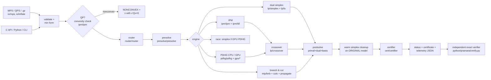

# PRAMANA architecture

PRAMANA (Sanskrit *pramāṇa*: "valid means of knowledge, proof") is a from-scratch LP / MILP /
convex-QP solver whose every answer is independently certified, which uses the GPU only where a
measured cost model says it pays, and which is engineered for the repeated-solve structure of
refinery planning.

## Pipeline

Every public status passes through the certifier. A claim it cannot prove is downgraded
(OPTIMAL → ITERATION_LIMIT when the point is feasible but optimality is unproven, otherwise
NUMERICAL_FAILURE). The simplex itself also runs the rigorous Farkas check *before* it claims
infeasibility ("certify-before-claim"), and B&B only prunes nodes by proven infeasibility or by
safe bounds.

## Modules (`src/`)

| module | responsibility | key files |
|---|---|---|
| `util` | JSON, logging, deterministic RNG, timers/deadlines (with cooperative cancel), thread pool | `json.cpp`, `parallel.cpp`, `timer.h` |
| `core` | model (bounds on rows *and* columns, integrality, Q), CSC/CSR sparse storage, hyper-sparse vectors | `model.h`, `sparse.h` |
| `io` | free + fixed MPS/QPS reader/writer (RANGES semantics, all bound types, MARKER, QUADOBJ/QMATRIX), own DEFLATE decoder | `mps.cpp`, `inflate.cpp` |
| `presolve` | empty/singleton/redundant/forcing rows, fixed/empty/dominated columns, implied-free column singletons; full primal + dual + basis postsolve; QP-safe subset | `presolve.cpp` |
| `lp` | sparse Markowitz LU with PFI updates and rank repair; bounded dual simplex (DSE, BFRT + Harris, perturbation, cost shifting, dual phase 1 subproblem, stall recovery, dual polish), primal simplex; scaling; crossover | `lu.cpp`, `simplex.cpp` |
| `ipm` | quotient-graph minimum-degree ordering, up-looking LDLᵀ with dynamic regularization, Mehrotra predictor–corrector for LP and convex QP, convexity certificate | `ldl.cpp`, `ipm.cpp` |
| `pdhg` | restarted reflected-Halpern PDHG with Ruiz/Pock–Chambolle preconditioning; CPU and CUDA backends running the same operation sequence; batched solves | `pdhg.cpp`, `kernels.cpp` |
| `gpu` | runtime loader for the CUDA driver API and NVRTC (no build-time CUDA dependency), PTX cache | `cuda_driver.cpp` |
| `mip` | branch-and-cut: reliability branching, best-bound + plunging, propagation, GMI/MIR/cover cuts, rounding/diving/feasibility pump, fix-and-resolve, safe node bounds | `bnb.cpp`, `cuts.cpp`, `propagate.cpp` |
| `cert` | outward-rounded interval arithmetic (TwoSum/TwoProduct), Neumaier–Shcherbina safe bounds, Farkas / ray / QP checks, backward-error reporting | `certifier.cpp`, `interval.h` |
| `router` | structural features, log-linear engine cost model (calibrated offline), decision log | `router.cpp` |
| `parametric` | certified parametric analysis (tangent-intersection sweep), case-family comparison, PDHG bandwidth calibration | `parametric.cpp` |
| `api` | orchestration (`solve()`), C API | `solver.cpp`, `c_api.cpp` |
| `cli` | `pramana` command line | `main.cpp` |

## Hardware split (why each part runs where it runs)

| work | runs on | reason |
|---|---|---|
| simplex (FTRAN/BTRAN, pricing, ratio test), LU | CPU | tiny, irregular, latency-bound work per iteration; no exploitable parallelism |
| B&B tree, cuts, propagation, heuristics | CPU | irregular control flow, per-node host decisions |
| IPM factorization | CPU | own LDLᵀ (a GPU sparse direct solver would be a library dependency) |
| PDHG iterations (SpMV, SpMM, fused vector ops, reductions) | GPU or CPU | memory-bandwidth-bound; the GPU wins above a *measured* size |
| batched LP families | GPU | one SpMM reads A once for k LPs |
| certification | CPU | needs directed rounding and exact bookkeeping |

The router predicts the certified end-to-end time of each engine from cheap features and is
validated on held-out instances (`bench/fit_router.py`, `results/router/summary.md`).

## Determinism

Single-threaded simplex / IPM / B&B are deterministic (fixed seeds, no data races). The CPU PDHG
backend uses static chunking so reductions have a fixed order. GPU reductions use fixed block
partitions (deterministic per device); CPU vs GPU iterates agree up to reduction order
(unit test `pdhg_cpu_matches_optimum_and_gpu_agrees`).
