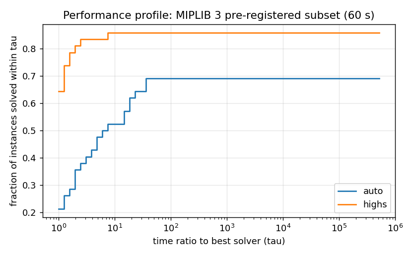
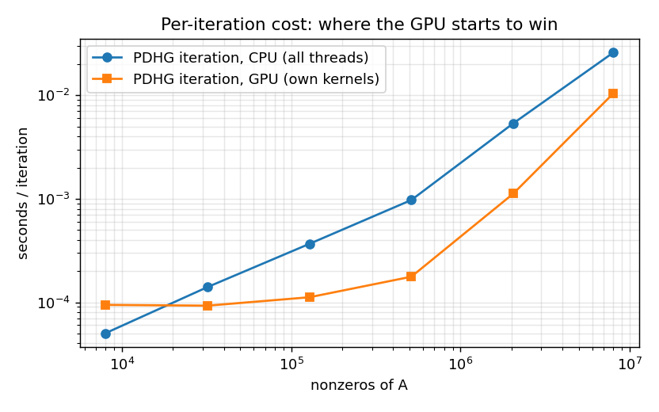
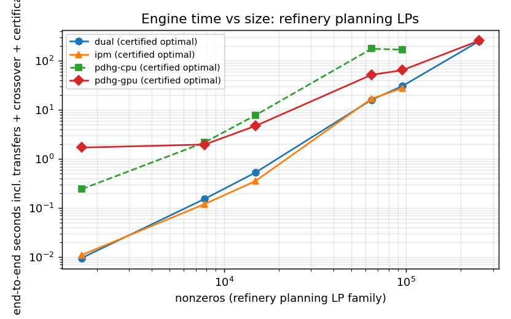

# PRAMANA benchmark report

Generated by `bench/report.py` from `results/*/runs.csv` (raw per-run JSON in `results/*/json`).
Every per-instance table, including every failure, is in `results/<set>/summary.md`.
Machine: see `results/machine.json`. Reference solver: HiGHS through scipy (same machine, same limits).
PRAMANA times include presolve, postsolve, crossover and certification; file reading excluded for both.

## Netlib LP (all 91 feasible)

| solver | proven | certified | SGM s (shift 10) | disagreements with HiGHS (1e-6 LP, 1e-4 MIP gap) |
|---|---|---|---|---|
| dual | 91/91 | 91 | 0.326 | 0 |
| highs | 91/91 | - | 0.245 | - |

Full table: [results/netlib/summary.md](../results/netlib/summary.md)

## Netlib infeasible LPs (all 29)

| solver | proven | certified | SGM s (shift 10) | disagreements with HiGHS (1e-6 LP, 1e-4 MIP gap) |
|---|---|---|---|---|
| dual | 29/29 | 29 | 0.239 | 0 |
| highs | 28/29 | - | 1.279 | - |

Full table: [results/netlib-infeas/summary.md](../results/netlib-infeas/summary.md)

## Netlib LP: other PRAMANA engines (30 s)

| solver | proven | certified | SGM s (shift 10) | disagreements with HiGHS (1e-6 LP, 1e-4 MIP gap) |
|---|---|---|---|---|
| ipm | 90/91 | 90 | 0.486 | 0 |
| pdhg-cpu | 79/91 | 79 | 3.324 | 0 |
| pdhg-gpu | 80/91 | 80 | 4.566 | 0 |

Full table: [results/netlib_engines/summary.md](../results/netlib_engines/summary.md)

## Industrial suite (refinery planning / blending / scheduling / UC / dispatch)

| solver | proven | certified | SGM s (shift 10) | disagreements with HiGHS (1e-6 LP, 1e-4 MIP gap) |
|---|---|---|---|---|
| dual | 14/18 | 14 | 11.880 | 0 |
| ipm | 14/18 | 14 | 11.867 | 0 |
| pdhg-cpu | 14/18 | 14 | 16.728 | 0 |
| pdhg-gpu | 14/18 | 14 | 13.822 | 0 |
| highs | 17/18 | - | 6.321 | - |

Full table: [results/gen/summary.md](../results/gen/summary.md)

## MIPLIB 3 pre-registered subset (60 s)

| solver | proven | certified | SGM s (shift 10) | disagreements with HiGHS (1e-6 LP, 1e-4 MIP gap) |
|---|---|---|---|---|
| auto | 29/42 | 29 | 14.107 | 0 |
| highs | 36/42 | - | 5.869 | - |

Full table: [results/miplib3/summary.md](../results/miplib3/summary.md)

## MIPLIB 3 subset WITHOUT cutting planes (ablation)

| solver | proven | certified | SGM s (shift 10) | disagreements with HiGHS (1e-6 LP, 1e-4 MIP gap) |
|---|---|---|---|---|
| auto | 26/42 | 26 | 14.107 | 0 |

Full table: [results/miplib3_nocuts/summary.md](../results/miplib3_nocuts/summary.md)

## Maros-Meszaros convex QP (124 instances, 60 s)

| solver | proven | certified | SGM s (shift 10) | disagreements with HiGHS (1e-6 LP, 1e-4 MIP gap) |
|---|---|---|---|---|
| auto | 105/124 | 105 | 3.542 | 0 |

Full table: [results/maros/summary.md](../results/maros/summary.md)

## Adversarial suite

| solver | proven | certified | SGM s (shift 10) | disagreements with HiGHS (1e-6 LP, 1e-4 MIP gap) |
|---|---|---|---|---|
| auto | 16/17 | 16 | 1.257 | 4 |
| highs | 17/17 | - | 0.013 | - |

Full table: [results/adversarial/summary.md](../results/adversarial/summary.md)

### Adversarial ground truth (scaled models have the SAME optimum as the original Netlib model)

| instance | truth | PRAMANA | HiGHS (scipy) |
|---|---|---|---|
| infeasthin_50 | INFEASIBLE  | INFEASIBLE  (correct) | INFEASIBLE  (correct) |
| kleeminty_12 | OPTIMAL 2.4414062e+08 | OPTIMAL 2.4414062e+08 (correct) | OPTIMAL 2.4414062e+08 (correct) |
| kleeminty_20 | OPTIMAL 9.5367432e+13 | OPTIMAL 9.5367432e+13 (correct) | OPTIMAL 9.5367432e+13 (correct) |
| scaled_adlittle | OPTIMAL 225494.96 | OPTIMAL 225494.96 (correct) | OPTIMAL 187880.5 (**WRONG**) |
| scaled_afiro | OPTIMAL -464.75314 | OPTIMAL -464.75314 (correct) | OPTIMAL -458.92457 (**WRONG**) |
| scaled_bandm | OPTIMAL -158.62802 | OPTIMAL -158.62802 (correct) | INFEASIBLE  (**WRONG**) |
| scaled_blend | OPTIMAL -30.81215 | OPTIMAL -30.81215 (correct) | UNBOUNDED  (**WRONG**) |
| scaled_e226 | OPTIMAL -11.638929 | OPTIMAL -11.638929 (correct) | OPTIMAL -18.513294 (**WRONG**) |
| scaled_sc50a | OPTIMAL -64.575077 | OPTIMAL -64.575077 (correct) | OPTIMAL -86.666667 (**WRONG**) |
| scaled_scfxm1 | OPTIMAL 18416.759 | NUMERICAL_FAILURE 18416.759 (no claim) | INFEASIBLE  (**WRONG**) |
| scaled_share1b | OPTIMAL -76589.319 | OPTIMAL -76589.319 (correct) | INFEASIBLE  (**WRONG**) |
| unbnd_30 | UNBOUNDED  | UNBOUNDED 0 (correct) | UNBOUNDED  (correct) |

Score (correct / WRONG / no claim): PRAMANA [11, 0, 1], HiGHS [4, 8, 0].

## Ablation: cutting planes (GMI + MIR + cover) on/off

| instance | with cuts: status / nodes / s | without cuts: status / nodes / s |
|---|---|---|
| 10teams | TIME_LIMIT / 177 / 60.06 | TIME_LIMIT / 6908 / 60.02 |
| bell3a | OPTIMAL / 57981 / 7.40 | OPTIMAL / 55283 / 2.58 |
| bell5 | OPTIMAL / 92485 / 21.69 | TIME_LIMIT / 1750260 / 61.27 |
| blend2 | OPTIMAL / 3399 / 3.76 | OPTIMAL / 6650 / 1.07 |
| dcmulti | TIME_LIMIT / 10861 / 60.01 | OPTIMAL / 1748 / 0.45 |
| egout | OPTIMAL / 5 / 0.01 | OPTIMAL / 2505 / 0.09 |
| enigma | OPTIMAL / 6241 / 1.20 | OPTIMAL / 1415 / 0.10 |
| fixnet6 | OPTIMAL / 69025 / 57.66 | TIME_LIMIT / 298483 / 60.32 |
| flugpl | OPTIMAL / 1109 / 0.05 | OPTIMAL / 1138 / 0.01 |
| gesa2 | OPTIMAL / 610 / 1.92 | TIME_LIMIT / 76457 / 60.17 |
| gesa2_o | OPTIMAL / 4912 / 13.70 | TIME_LIMIT / 84421 / 60.17 |
| gesa3 | OPTIMAL / 111 / 2.40 | OPTIMAL / 10129 / 6.63 |
| gesa3_o | OPTIMAL / 181 / 2.88 | OPTIMAL / 13779 / 10.36 |
| gt2 | OPTIMAL / 11 / 0.09 | OPTIMAL / 3650 / 0.12 |
| khb05250 | OPTIMAL / 25 / 0.34 | OPTIMAL / 1845 / 0.34 |
| lseu | OPTIMAL / 1398 / 0.64 | OPTIMAL / 39178 / 0.99 |
| markshare1 | TIME_LIMIT / 701201 / 60.37 | TIME_LIMIT / 1386630 / 60.87 |
| markshare2 | TIME_LIMIT / 584340 / 60.33 | TIME_LIMIT / 1034559 / 60.83 |
| mas74 | TIME_LIMIT / 214894 / 60.18 | TIME_LIMIT / 292773 / 60.27 |
| mas76 | TIME_LIMIT / 409329 / 60.30 | TIME_LIMIT / 307361 / 60.30 |
| misc03 | OPTIMAL / 1196 / 2.72 | OPTIMAL / 1261 / 0.43 |
| misc06 | OPTIMAL / 57 / 0.24 | OPTIMAL / 54 / 0.08 |
| misc07 | TIME_LIMIT / 47909 / 60.02 | OPTIMAL / 78983 / 46.05 |
| mod008 | OPTIMAL / 113 / 1.03 | OPTIMAL / 12143 / 1.04 |
| mod010 | OPTIMAL / 0 / 0.05 | OPTIMAL / 93 / 0.65 |
| noswot | TIME_LIMIT / 359502 / 60.18 | TIME_LIMIT / 254530 / 60.23 |
| p0033 | OPTIMAL / 35 / 0.03 | OPTIMAL / 388 / 0.01 |
| p0201 | OPTIMAL / 176 / 5.39 | OPTIMAL / 569 / 0.28 |
| p0282 | OPTIMAL / 72 / 1.75 | OPTIMAL / 530 / 0.12 |
| p0548 | OPTIMAL / 29 / 0.37 | OPTIMAL / 26112 / 3.11 |
| p2756 | OPTIMAL / 173 / 3.30 | TIME_LIMIT / 105555 / 60.14 |
| pk1 | TIME_LIMIT / 164211 / 60.12 | TIME_LIMIT / 273144 / 60.29 |
| pp08a | TIME_LIMIT / 17349 / 60.02 | TIME_LIMIT / 331906 / 60.33 |
| pp08aCUTS | TIME_LIMIT / 19746 / 60.02 | TIME_LIMIT / 180695 / 60.17 |
| qnet1 | OPTIMAL / 216 / 50.02 | OPTIMAL / 300 / 1.26 |
| qnet1_o | OPTIMAL / 92 / 24.51 | OPTIMAL / 669 / 1.19 |
| rgn | OPTIMAL / 3903 / 1.53 | OPTIMAL / 4996 / 0.21 |
| set1ch | TIME_LIMIT / 24022 / 60.04 | TIME_LIMIT / 119842 / 60.20 |
| stein27 | OPTIMAL / 3998 / 0.91 | OPTIMAL / 4147 / 0.26 |
| stein45 | OPTIMAL / 50247 / 30.83 | OPTIMAL / 53400 / 10.98 |
| vpm1 | OPTIMAL / 255 / 0.38 | OPTIMAL / 180628 / 12.32 |
| vpm2 | TIME_LIMIT / 49637 / 60.04 | TIME_LIMIT / 692295 / 60.47 |

# Repeated-solve (crude valuation) experiment

Exact = certified parametric sweep. Errors are max relative errors vs the exact value function.

## plan_10x12: crude CR03 price (period 0), $/bbl, negated (max model)

- parameter `BUY_CR03_0` (cost) in [-95.0, -35.0], K = 64 sampled cases
- exact breakpoints: 3 (2 segments contain no sample -> invisible to any sampling strategy)
- breakpoints: -68.2646, -68.1292, -68.1193

| strategy | seconds | solved | certified | max rel. error | note |
|---|---|---|---|---|---|
| parametric sweep (exact, certified) | 0.140 | 4 | 4 | 0.00e+00 | 4 segments, 3190 pivots; certificates per segment |
| cold dual simplex x K | 10.048 | 64 | 64 | 8.51e-16 | independent solves (incl. certification) |
| warm-started simplex chain | 0.190 | 64 | 64 | 3.39e-16 | 3169 pivots total |
| batched PDHG (CPU) 1e-6 + safe bounds | 18.974 | 64 | 64 | 2.73e-06 | 16 threads, 18560 iterations, kernel 17.313s, transfer 0.039s, setup 1.659s; certified = safe bound within 1e-4 |
| batched PDHG (GPU) 1e-6 + safe bounds | 3.787 | 64 | 64 | 2.73e-06 | NVIDIA GeForce RTX 4050 Laptop GPU, 18560 iterations, kernel 3.759s, transfer 0.076s, setup 0.024s; certified = safe bound within 1e-4 |

## plan_10x12: crude CR03 availability (period 0), kbbl

- parameter `BUY_CR03_0` (upper) in [0.0, 120.0], K = 64 sampled cases
- exact breakpoints: 18 (2 segments contain no sample -> invisible to any sampling strategy)
- breakpoints: 2.99514, 3.34439, 49.6512, 51.7112, 54.7239, 56.6473, 62.181, 73.1157, 86.4339, 87.2694, 87.9345, 90.9976 ...

| strategy | seconds | solved | certified | max rel. error | note |
|---|---|---|---|---|---|
| parametric sweep (exact, certified) | 0.163 | 19 | 19 | 0.00e+00 | 19 segments, 3291 pivots; certificates per segment |
| cold dual simplex x K | 9.907 | 64 | 64 | 1.36e-15 | independent solves (incl. certification) |
| warm-started simplex chain | 0.191 | 64 | 64 | 1.28e-14 | 3219 pivots total |
| batched PDHG (CPU) 1e-6 + safe bounds | 24.632 | 64 | 64 | 2.84e-06 | 16 threads, 23488 iterations, kernel 22.966s, transfer 0.042s, setup 1.664s; certified = safe bound within 1e-4 |
| batched PDHG (GPU) 1e-6 + safe bounds | 4.823 | 64 | 64 | 2.84e-06 | NVIDIA GeForce RTX 4050 Laptop GPU, 23488 iterations, kernel 4.792s, transfer 0.073s, setup 0.027s; certified = safe bound within 1e-4 |

## plan_20x12: crude CR07 price (period 3)

- parameter `BUY_CR07_3` (cost) in [-100.0, -30.0], K = 64 sampled cases
- exact breakpoints: 22 (21 segments contain no sample -> invisible to any sampling strategy)
- breakpoints: -69.7383, -69.7373, -69.7324, -69.7274, -69.7197, -69.7121, -69.7055, -69.7011, -69.695, -69.6817, -69.6348, -69.1328 ...

| strategy | seconds | solved | certified | max rel. error | note |
|---|---|---|---|---|---|
| parametric sweep (exact, certified) | 0.637 | 23 | 23 | 0.00e+00 | 23 segments, 7139 pivots; certificates per segment |
| cold dual simplex x K | 38.230 | 64 | 64 | 9.34e-16 | independent solves (incl. certification) |
| warm-started simplex chain | 0.688 | 64 | 64 | 5.84e-16 | 6375 pivots total |
| batched PDHG (CPU) 1e-6 + safe bounds | 80.931 | 64 | 64 | 2.58e-06 | 16 threads, 49920 iterations, kernel 80.310s, transfer 0.067s, setup 0.619s; certified = safe bound within 1e-4 |
| batched PDHG (GPU) 1e-6 + safe bounds | 19.419 | 64 | 64 | 2.58e-06 | NVIDIA GeForce RTX 4050 Laptop GPU, 49920 iterations, kernel 19.367s, transfer 0.149s, setup 0.049s; certified = safe bound within 1e-4 |

## plan_20x52: crude CR05 availability (week 10)

- parameter `BUY_CR05_10` (upper) in [0.0, 200.0], K = 32 sampled cases
- exact breakpoints: 3 (0 segments contain no sample -> invisible to any sampling strategy)
- breakpoints: 25.5207, 26.3146, 36.812

| strategy | seconds | solved | certified | max rel. error | note |
|---|---|---|---|---|---|
| parametric sweep (exact, certified) | 8.825 | 4 | 4 | 0.00e+00 | 4 segments, 28059 pivots; certificates per segment |
| cold dual simplex x K | 272.982 | 32 | 32 | 2.61e-09 | independent solves (incl. certification) |
| warm-started simplex chain | 9.434 | 32 | 32 | 2.61e-09 | 28026 pivots total |
| batched PDHG (CPU) 1e-6 + safe bounds | 803.309 | 0 | 0 | 0.00e+00 | 16 threads, 200000 iterations, kernel 801.504s, transfer 0.104s, setup 1.737s; certified = safe bound within 1e-4 |
| batched PDHG (GPU) 1e-6 + safe bounds | 167.071 | 0 | 0 | 0.00e+00 | NVIDIA GeForce RTX 4050 Laptop GPU, 200000 iterations, kernel 166.876s, transfer 0.158s, setup 0.097s; certified = safe bound within 1e-4 |

# Router validation (5-fold cross-validation, held-out instances)

Instances: 99 LPs (91 Netlib, 8 refinery planning). Engines: dual, ipm, pdhg-cpu, pdhg-gpu.

| policy | geo-mean regret (time / oracle time) | worst regret | picks the fastest engine |
|---|---|---|---|
| **PRAMANA router (held-out)** | 1.062 | 11.3 | 89% |
| always dual | 1.059 | 11.3 | 90% |
| always ipm | 1.796 | 11.7 | 12% |
| always pdhg-cpu | 47.685 | 4278.5 | 2% |
| always pdhg-gpu | 113.305 | 18498.7 | 2% |

Oracle (fastest certified engine) counts: dual: 89, ipm: 10, pdhg-cpu: 0, pdhg-gpu: 0

## PDHG per-iteration cost: CPU (all threads) vs GPU (own kernels)

`pramana calibrate`: one PDHG iteration (2 SpMV + fused vector updates) on synthetic LPs.

| nnz | CPU ms/iter | GPU ms/iter | GPU speedup |
|---|---|---|---|
| 7,993 | 0.050 | 0.094 | 0.53x |
| 31,989 | 0.140 | 0.093 | 1.51x |
| 127,994 | 0.367 | 0.112 | 3.28x |
| 511,988 | 0.972 | 0.177 | 5.51x |
| 2,047,987 | 5.349 | 1.120 | 4.78x |
| 7,999,987 | 25.894 | 10.444 | 2.48x |

## CPU vs GPU on the refinery planning family (end-to-end seconds, 300 s limit)

Columns dual..pdhg-gpu: exactly certified optimum (PDHG followed by crossover). Raw columns: first-order
answer at 1e-4 relative KKT *without* crossover. Its primal point is NOT feasible to 1e-6 (so it is never
reported as OPTIMAL), but its duals give a rigorous Neumaier-Shcherbina bound; brackets show that bound's
relative distance from the true optimum (reference optimum: any certified run of the same model, else HiGHS).

| model | nnz | dual | ipm | pdhg-cpu | pdhg-gpu | raw pdhg-cpu 1e-4 [bound err] | raw pdhg-gpu 1e-4 [bound err] | HiGHS |
|---|---|---|---|---|---|---|---|---|
| plan_6x4 | 1653 | 0.01 | 0.01 | 0.24 | 1.71 | 0.09 [2.1e-03] | 0.28 [2.1e-03] | 0.01 |
| plan_10x12 | 7809 | 0.15 | 0.12 | 2.17 | 1.97 | 0.53 [5.6e-04] | 0.53 [5.6e-04] | 0.05 |
| plan_20x12 | 14879 | 0.53 | 0.35 | 7.82 | 4.73 | 1.61 [4.2e-05] | 1.37 [4.2e-05] | 0.13 |
| plan_20x52 | 64559 | 16.12 | 16.94 | 177.61 | 52.23 | 2.41 [6.4e-04] | 1.04 [6.4e-04] | 1.35 |
| plan_30x52 | 95229 | 30.65 | 27.95 | 170.22 | 64.75 | 9.00 [4.2e-04] | 3.36 [4.2e-04] | 3.89 |
| plan_40x104 | 251843 | 253.88 | 307.99 (TIME_LIMIT) | 300.22 (ITERATION_LIMIT) | 260.15 | 13.22 [2.7e-04] | 3.61 [2.7e-04] | 26.65 |
| plan_60x156 | 561847 | 300.08 (TIME_LIMIT) | 317.37 (TIME_LIMIT) | 300.14 (TIME_LIMIT) | 651.71 (TIME_LIMIT) | 27.17 [1.2e-04] | 11.06 [1.2e-04] | 91.76 |

Note: the HiGHS column comes from the `gen` benchmark run (120 s limit); timings from different
runs on this laptop vary by up to ~2x (thermal/power state), so compare within a column group.

