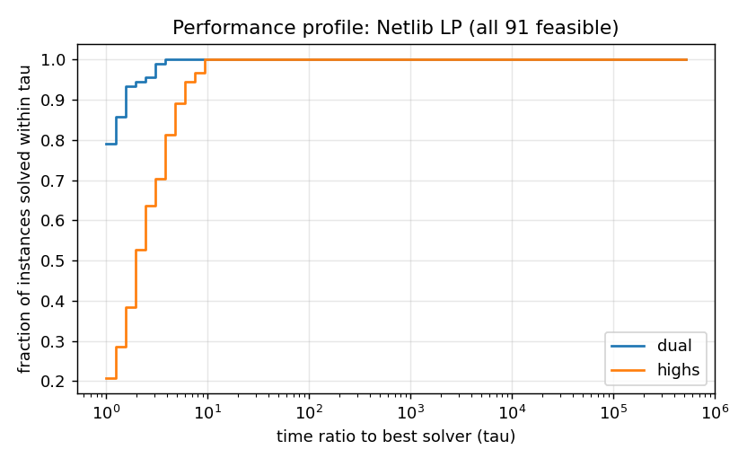
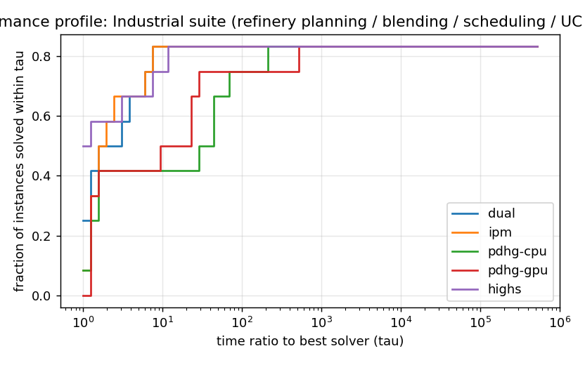

# PRAMANA benchmark report

Generated by `bench/report.py` from `results/*/runs.csv` (raw per-run JSON in `results/*/json`).
Every per-instance table, including every failure, is in `results/<set>/summary.md`.
Machine: see `results/machine.json`. Reference solver: HiGHS through scipy (same machine, same limits).
PRAMANA times include presolve, postsolve, crossover and certification; file reading excluded for both.

## Netlib LP (all 91 feasible)

| solver | proven | certified | SGM s (shift 10) | disagreements with HiGHS |
|---|---|---|---|---|
| dual | 91/91 | 91 | 0.222 | 0 |
| highs | 91/91 | - | 0.125 | - |

Full table: [results/netlib/summary.md](../results/netlib/summary.md)

## Netlib infeasible LPs (all 29)

| solver | proven | certified | SGM s (shift 10) | disagreements with HiGHS |
|---|---|---|---|---|
| dual | 29/29 | 29 | 0.174 | 0 |
| highs | 28/29 | - | 1.270 | - |

Full table: [results/netlib-infeas/summary.md](../results/netlib-infeas/summary.md)

## Industrial suite (refinery planning / blending / scheduling / UC / dispatch)

| solver | proven | certified | SGM s (shift 10) | disagreements with HiGHS |
|---|---|---|---|---|
| dual | 10/12 | 10 | 10.156 | 0 |
| ipm | 10/12 | 10 | 10.146 | 0 |
| pdhg-cpu | 10/12 | 10 | 16.857 | 0 |
| pdhg-gpu | 10/11 | 10 | 9.374 | 0 |
| highs | 10/11 | - | 6.942 | - |

Full table: [results/gen/summary.md](../results/gen/summary.md)

## Maros-Meszaros convex QP (124 instances, 60 s)

| solver | proven | certified | SGM s (shift 10) | disagreements with HiGHS |
|---|---|---|---|---|
| auto | 91/124 | 91 | 6.854 | 0 |

Full table: [results/maros/summary.md](../results/maros/summary.md)

## Adversarial suite

| solver | proven | certified | SGM s (shift 10) | disagreements with HiGHS |
|---|---|---|---|---|
| auto | 15/17 | 15 | 2.624 | 4 |
| highs | 17/17 | - | 0.007 | - |

Full table: [results/adversarial/summary.md](../results/adversarial/summary.md)

### Adversarial ground truth (scaled models have the SAME optimum as the original Netlib model)

| instance | truth | PRAMANA | HiGHS (scipy) |
|---|---|---|---|
| infeasthin_50 | INFEASIBLE  | ITERATION_LIMIT 50 (no claim) | INFEASIBLE  (correct) |
| kleeminty_12 | OPTIMAL 2.4414062e+08 | OPTIMAL 2.4414062e+08 (correct) | OPTIMAL 2.4414062e+08 (correct) |
| kleeminty_20 | OPTIMAL 9.5367432e+13 | OPTIMAL 9.5367432e+13 (correct) | OPTIMAL 9.5367432e+13 (correct) |
| scaled_adlittle | OPTIMAL 225494.96 | OPTIMAL 225494.96 (correct) | OPTIMAL 187880.5 (**WRONG**) |
| scaled_afiro | OPTIMAL -464.75314 | OPTIMAL -464.75314 (correct) | OPTIMAL -458.92457 (**WRONG**) |
| scaled_bandm | OPTIMAL -158.62802 | OPTIMAL -158.62802 (correct) | INFEASIBLE  (**WRONG**) |
| scaled_blend | OPTIMAL -30.81215 | OPTIMAL -0.0038222697 (**WRONG**) | UNBOUNDED  (**WRONG**) |
| scaled_e226 | OPTIMAL -11.638929 | OPTIMAL -11.638929 (correct) | OPTIMAL -18.513294 (**WRONG**) |
| scaled_sc50a | OPTIMAL -64.575077 | OPTIMAL -64.575077 (correct) | OPTIMAL -86.666667 (**WRONG**) |
| scaled_scfxm1 | OPTIMAL 18416.759 | NUMERICAL_FAILURE 18416.759 (no claim) | INFEASIBLE  (**WRONG**) |
| scaled_share1b | OPTIMAL -76589.319 | OPTIMAL -76589.319 (correct) | INFEASIBLE  (**WRONG**) |
| unbnd_30 | UNBOUNDED  | UNBOUNDED 0 (correct) | UNBOUNDED  (correct) |

Score (correct / WRONG / no claim): PRAMANA [9, 1, 2], HiGHS [4, 8, 0].

